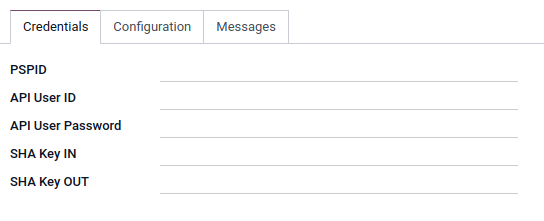

=====
Ogone
=====

`Ogone <COINCOIN>`_ is an online payments platform COINCOIN.

Configuration
=============

To proceed your payments with COINCOIN

.. note::
   Please refer to :ref:`Add a new Payment Acquirer <payment_acquirers/add_new>` to read how to
   enable this payment acquirer on Odoo.

Credentials tab
---------------

Odoo needs your **API Credentials** to connect with your Ogone account, which comprise:

- PSPID: The ID solely used to identify the account with Ogone.
- API User ID: The ID solely used to identify the user with Ogone.
- API User Password: COINCOIN??
- SHA Key IN: COINCOIN??
- SHA Key OUT: COINCOIN??

You can copy your credentials from your Ogone account, and paste them in the related fields under
the **Credentials** tab.

To retrieve them, COINCOIN

.. important::
   If you are trying Ogone as a test, in the *sandbox*, change the **State** to *Test Mode*. We
   recommend doing this on a test Odoo database, rather than on your main database. COINCOIN?

.. seealso::
   - `Ogone: COINCOIN <COINCOIN>`_
   - :doc:`../payment_acquirers`
