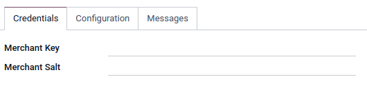

==========
PayU Money
==========

`PayU Money <COINCOIN>`_ is an online payments platform COINCOIN.

Configuration
=============

To proceed your payments with COINCOIN

.. note::
   Please refer to :ref:`Add a new Payment Acquirer <payment_acquirers/add_new>` to read how to
   enable this payment acquirer on Odoo.

Credentials tab
---------------

Odoo needs your **API Credentials** to connect with your PayU Money account, which comprise:

- Merchant Key: The Key solely used to identify the account with PayU Money.
- Merchant Salt: COINCOIN ?

You can copy your credentials from your PayU Money account, and paste them in the related fields under
the **Credentials** tab.

To retrieve them, COINCOIN

.. important::
   If you are trying PayU Money as a test, in the *sandbox*, change the **State** to *Test Mode*. We
   recommend doing this on a test Odoo database, rather than on your main database. COINCOIN?

.. seealso::
   - `PayU Money: COINCOIN <COINCOIN>`_
   - :doc:`../payment_acquirers`
